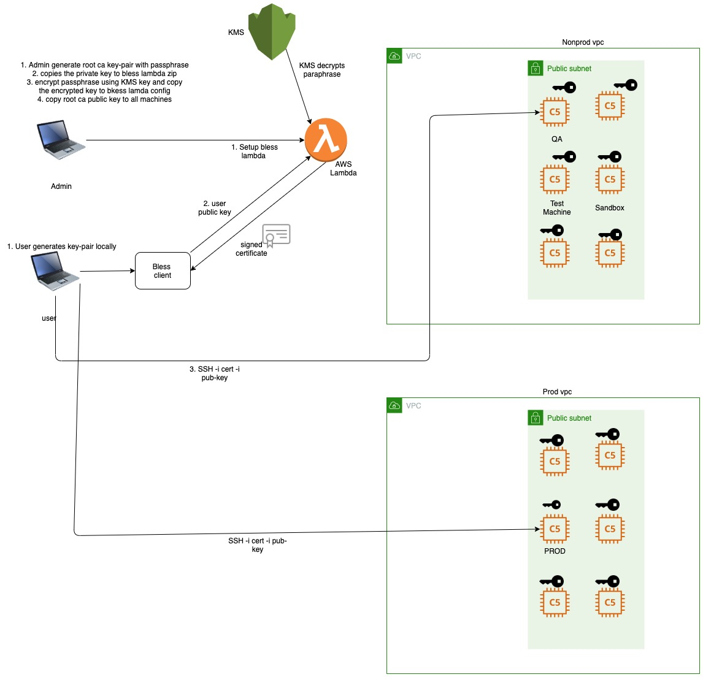

# Netflix Bless
BLESS is an SSH Certificate Authority that runs as an AWS Lambda function and is used to sign SSH public keys. SSH Certificates are an excellent way to authorize users to access a particular SSH host, as they can be restricted for a single use case, and can be short lived. Instead of managing the authorized_keys of a host, or controlling who has access to SSH Private Keys, hosts just need to be configured to trust an SSH CA

# Design


They are two flows invloved in bless 

- Admin flow(Netflix bless setup): Admin generates root CA key-pair with passphrase and copies the private key to bless lambda configuration. Encrypt passphrase using KMS key and copy the encrypted key to bless lambda config. Copy the root CA public key to all machines
- User flow: User has to generate key-pairs locally and send the public key using bless client to bless CA for generating the certificate and return back the signed certificate. Since root CA public key is already copied to all the hosts, the certificate signed by bless CA can be verified. Hence, the user can SSH into the machine using his signed certificate(with his public key) and his private key. The connection lasts for only few minutes as the keys are short lived.
# Admin flow setup
## Installation steps
- Clone the repo:
```
https://github.com/snapcheck/bless

- please click the below link and follow the steps to install the admin flow
```
https://github.com/snapcheck/bless

## Generating root CA key-pair:

- Generate a password protected RSA Private Key in the PEM format:
```
 ssh-keygen -t rsa -b 4096 -m PEM -f bless-ca- -C "SSH CA Key"
 ```
- Note: OpenSSH Public Key format is not supported.
- Use KMS to encrypt your passphrase. You will need a KMS key per region, and you will need to encrypt your password for each region.

# User flow setup
## Generating Key-pair locally: 
- Please follow below steps to generate keys locally and use your name in the place of "name" context
```
ssh-keygen -t rsa -b 4096 -m PEM -f id_rsa_name -C "name Key"

```
```
openssl rsa -in id_rsa_name -outform PEM -pubout -out id_rsa_name.pem

```
```
ssh-keygen -i -m PKCS8 -f id_rsa_name.pem > id_rsa_name.pub
```

# Bless client

- After delpoying BLESS run the sample BLESS Client from a system with access to the required AWS Credentials
- Download the bless python client locally using below link
https://github.com/Netflix/bless/blob/master/bless_client/bless_client.py


please run the below command to get signed certificate from AWS lambda

```
python bless_client/bless_client.py "us-east-1" "bless" "aparna" "67.169.175.5" "ubuntu" "67.169.175.5" "welcome to bless" ~/Desktop/snapcheck/sshkeys/aparna/id_rsa.pub id_rsa-cert.pub

```
Once you get the signed certificate, use your private key along with signed certificate to ssh into the host machine(desired machine)

```
ssh -i id_rsa-cert.pub -i ~/Desktop/snapcheck/sshkeys/aparna/id_rsa ubuntu@54.92.213.9

```

# Automation

## Admin flow automation
### Upload Bless CA keys to s3 bucket
Generate the root ca keys and upload the keys to the s3 bucket
https://s3.console.aws.amazon.com/s3/buckets/blessca-keys/?region=us-east-1&tab=overview

### Build and deploy bless CA
Inorder to build and deploy bless CA, Jenkins multibranch pipeline needs to be setup. Once the code is commited to github, kick off the the build pipeline to deploy the latest changes.
https://ci.gosnapcheck.com/job/bless-lambda/

### Copy CA public key to snapcheck infrastructure
Ansible playbooks are invoked to download the public key from s3 bucket to the all hosts machines at snapcheck infrastructure

```
ansible-playbook playbook.yaml -e 'ansible_python_interpreter=/usr/bin/python3' -vvv
```

## User flow automation
### Shell script to invoke the bless client lambda
Run this shell script to get signed certificated from bless CA. The certificate will be generated in the current folder with `id_rsa-cert.pub` name
```
./fetch_cert.sh  aparna ~/.ssh/id_rsa.pub
```

